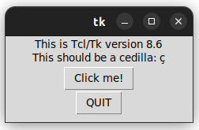
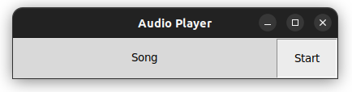
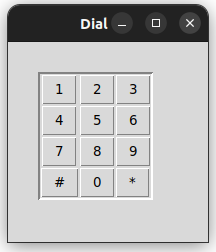
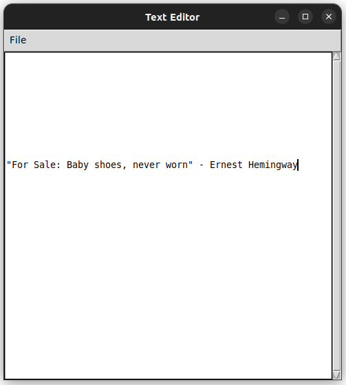
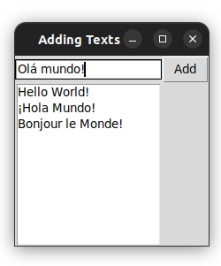
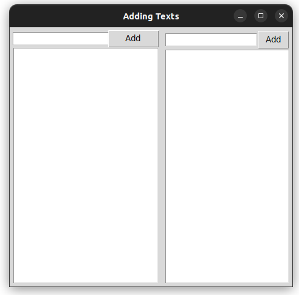

# Tkinter Notes

**Author:** Steve Jurado

**Instructors:**
- Metra Brains
- Corey Schafer
- Frank Anemaet

**Certificates:**
- [Meta Brains Certificate](./assets/certicates/Certificate_MetaBrains.jpg)
- [Frank Anemaet Certificate](./assets/certicates/Certificate_FrankAnemaet.jpg)

**Last Update** Aug 04/2024

I took some courses on the [Udemy Platform](https://www.udemy.com/) and I'm following the indicates of Corey Schafer on his [YouTube Channel](https://www.youtube.com/watch?v=epDKamC-V-8). 

The aim of this course was to learn how to create interfaces in Python using the `Tkinter` Python library.

Useful . It's part of the Standard libraries of Python.

Some remarkable pictures obtained in the learning process:

- Tkinter test function

  

- Project Audio Player using Tkinter

  

- Project Telephone Dial using Tkinter

  

  
</p

